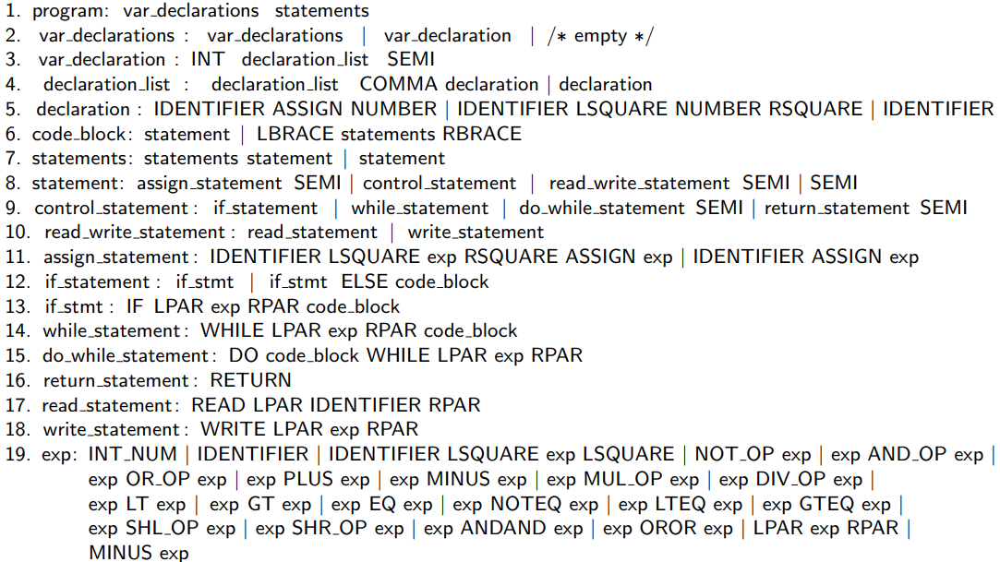

# A C-Like Compiler for MIPS Instruction Set

Jiaqi Li

# Overview

In this project, I have completed a simplified C compiler, including native C++ implementations of its scanner, parser and semantic routines (i.e., not using Flex or Yacc). The compiler can convert a simplified C language into MIPS assembly code. In this report, I will discuss the implementation details of scanner, parser and the semantic routines (codegen).

Here is the grammar of the language that the compiler can parse. It is a subset of the regular C grammar, with only `int` declarations and straightforward instructions with no function calls or declarations. It supports using `scanf` and `prinf` for IO.



The Context Free Grammar of the language.

Here is an overview of the comiler’s design:


# Running the program
To compiler the program, run:
```bash
cd SourceCode
make
cd ..
```

To run the compiler:
```bash
cd SourceCode
sh run_compiler.sh $file_path
cd ..
```
where $file_path is the path to the input code text.
Then, the compiled MIPS code will display in the terminal output.

This repository already comes with test cases. For example, to run the first test case:
```bash
cd SourceCode
sh run_compiler.sh $(pwd)/../TestCases/test1.c1
cd ..
```

# Scanner Implementation

The scanner is responsible for analyzing the input code and generating tokens from regular expressions that will be used later in the compilation process.

The flow is to first encode the regular expression (regex), then construct the NFA (Nondeterministic finite automaton), then convert the NFA into DFA (Deterministic finite automaton). The DFA is used to scan the code. 

## Designing the NFA

### Representing the finite states and transitions

The NFA is defined as a C++ class. The NFA is represented in a collection of NFA states represented by a vector of `State` objects. Each state has a state number that is assigned sequentially starting from 0. Inside every `State` object is a `Transition` object. It is a `vector` of char-int pairs. The char entry is the character in the code, while the integer indicates the next state’s index. In this way we realize the transition of the NFA.

It is worth noticing that labmda symbols are also important in NFA and DFA. I use char values of `-1` to denote them.

### Assembling the finite automata

Assembling the finite automata is done by using a set of functions that construct various parts of the NFA. I implement four of these basic algorithms. The **`new_char_nfa`** function creates a simple NFA with a single character, while **`concatenate`** combines two NFA fragments into a single NFA. The **`or_connection`** function creates a new NFA that accepts either of two input NFA fragments. Finally, **`star_symbol`** constructs an NFA that accepts zero or more repetitions of the input NFA fragment. These atomic functions are used together to build an NFA that recognizes the input regular expression.


### Avoiding character-level ambiguity

For some words like ‘write’ and ‘while’, they share some characters. Anothe example is that int and inte, one is a keyword and the other is an ID. 

This character-level ambiguity is solved by first scanning down the NFA we already have until we cannot go forward. Then, the untracked portion of the token states are added to the end of the current state.

## Converting NFA to **DFA**

After constructing the NFA, the next step is to convert it into a DFA using the subset construction algorithm. This algorithm takes as input the NFA and generates the equivalent DFA. I follow the following steps to construct such a DFA.

1. Calculate the epsilon closure for each state of the NFA. The epsilon closure is calcualted by adding the current state to a set, and then recursively adding any state that can be reached from the current state by following epsilon transitions. This set represents all the states that can be reached from the current state by following the lambda symbol.
2. Remove subsets. In this stage, we remove any epsilon closure that is a subset of another. The remaining non-subset NFA states are added to the DFA states.
3. Create transitions between the DFA states. More specifically, for each of the DFA states, we get its corresponding NFA states set. For each of the NFA states, we get the transitions and determine which DFA state the transition destination **is a subset of**. After determining this, we can add the transition between the source DFA and destination DFA.

# Parser Implementation

The parser analyzes the tokens generated from the scanner, and analyzes the syntactic structure of the code. During the parsing process, the state information, including current state’s id, next symbol(token), shift/go to which state, or reduce by which grammar, as well as the parsing stack after taking the action is printed out to the console.

The flow is to first construct the LR(1) finite state machine(FSM), building its action table and goto table. After the construction is done, a stream of scanned tokens is fed into the FSM to begin the actual parsing process.

## Constructing the LR(1) parsing table

There are two parts of the LR(1) parsing table, the action table and the goto table. The action table specifies what action to take when a terminal symbol is read from the input stream, including shift, reduce, error, or accept. The goto table specifies which state to transition to when a non-terminal symbol is read from the input. 

To build up these tables, a finite state machine is built, which consists of multiple item sets (represented in `ItemSet` class), and the transitions between them. An item set has a one-to-one correspondence to a parser state, while to goto table is encoded as state transition tables in each finite state.

### Building the closure of each item set

An item set contains several “stateful” production rules, which the currently processed symbol might be part of. Their states are denotes by “dots” to indicate the current parsing state. An item set originally starts with one or more start rules. and expanded to a “closure” of the item set using an algorithm. 

To build the closure, our program first finds out all the production rules, but keeps the lookahead fields of them empty. This is done by examining every production rule’s left-hand-side token and see if it matches the possible next token in any existing rules. If so, the new rule will be added to existing rules, until no further changes are done.

Next, the lookahead fields of each production rule is fillled. The lookahead field is a set of terminal tokens that can possibly be the token follownig the state. This is determined by the follow set algorithm, but only using the production rules in that item set instead of all registered production rules. The follow set algorithm includes calculating the first sets, which we omit here.

After filling the gotos, a state transition table is built by  filtering out the production rules that has each possible lookahead token, and for each such token it will be transited to the next state, which is recursively built or using an existing state. 

Here’s a visualization of how the item sets may look like:


A visualization of item sets and their transitions

### Recursively build item sets

It only requires inputing commands to build the first item set (with only the start rule `system_goal -> program SCANEOF`). Each remaining item sets will be built recursively.

Here is how the new item sets are built: (citing from wikipedia, the same used in this project)

1. For each terminal and nonterminal symbol A appearing after a '•' in each already existing item set k, create a new item set m by adding to m all the rules of k where '•' is followed by A, but only if m will not be the same as an already existing item set after step 3.

2. shift all the '•'s for each rule in the new item set one symbol to the right

3. create the closure of the new item set

4. Repeat from step 1 for all newly created item sets, until no more new sets appear

## The parsing process

After constructing the LR(1) parser’s finite state machine, we could use it to parse a series of tokens. The parsing routine traces a `current_state` number, which is the id of the item set.

### Perform shift

The routine checks whether it can perform shift by looking up the next scanned token in the goto table of the current state. It can shift by updating the current state to the destination.

### Perform reduction

The routine can check whether it can perform reduction by checking whether the next token is a lookahead symbol in a production rule which is reaching its end. If so, it will pop the parsing stack, jumps back to the state before the production rule, and perform shift with the rule’s left-hand side token.

### Handling operator precedence

Operator precedence is handled by creating an “operator stack”, which traces the most recent operators being shifted. Every time there is a shift/reduce conflict (can perform both shift and reduce), we look at the operator stack top, and if the next token is of lower precedence, perform reduce, otherwise perform shift.

The operator precedence values are encoded from the C++ language’s reference. 

# Semantic Routines Implementation

The actual compiled codes are generated by the semantic routines. The semantic routines is a set of functions to perform upon each reduction of production rule, depending on which rule is being reduced, thus, the routine is invoked by the parser when it is about to finish each reduction.

I will discuss the following core aspects of the semantic routines (codegen):

1. The flow of semantic information
2. Generating codes
3. Handling different data types
4. Building a symbol table

### Semantic flow

The scanner returns a stream of scanned tokens, but no semantic information (like the “actual” variable name, the “actual” number) is carried along. Therefore, a class `Semantic` is designed to carry such information with the tokens. It is passed in a new stream by the scanner, with a one-to-one correspondance with the token stream.

There is also a one-to-one correspondance of a “semantic stack” with the parser stack. It is designed such that when a production rule is reduced, it will pop the semantic information of right-hand-side elements in the rule, and push back the derived left-hand-side’s semantic information to the semantic stack.

### Generating codes

Codes are synthesized in the aforementioned process of “pop the semantic information of right-hand-side and push back the derived left-hand-side” to the semantic stack. The codes are stored in a field called `instructions` in the `Semantic` class. For example, when reducing the rule `exp -> exp PLUS exp`, the derived left-hand-side semantic will first contain a merged instructions of the two `exp`s, with instructions to derive their sum added to the end. This left-hand-side is pushed to the semantic stack.

The codes are not printed out immediately after their synthesis, instead, they are printed at the reduction of the last production rule. This is because not all new instructions are added at the end, for the `if` and `while` operations, some labels or codes are added at the front or between two code segments.

### Handling different data types

There are three data types represented in the `Semantic` class: 

- **integer literal**
- **variable**
- **expression**

and we have some design assumptions across the compiler implementation:

1. All variables are stored in specific memory addresses, i.e., not residing in a register
2. All expressions are stored in specific memory addresses
3. Integer literal are hard-coded at compile time, thus not requiring memory

### IO Syscalls

There are two IO operations in the language: `scanf` and `printf`. 

- To finish `read` operation we first load 5 in $v0, then call `syscall`. The result is in $v0
- To finish `write` operation we first load the output value to $a0, 1 into $v0, and call `syscall`

### Symbol Table

The symbol table stores variable information, including variable name and at which location are they stored. Because we assume all variables have memory location, it only stores the memory offset to `$sp`.

To support scoping, the symbol table is implemented with a `std::vector<std::map<std::string, int>>` , with scoping information in the index of the vector. To find a memory address of a variable, it finds the variable starting from the latest scope to the global scope.

# Conclusion

This project is about an compiler implementation with C++ and no use of external libraries. The compiler can convert a simplified C language into MIPS assembly code. It contains a scanner, a parser and semantic routines.